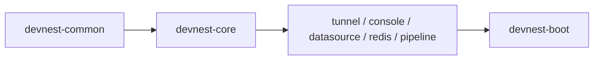

# 项目结构

## 目录总览

```text
devnest/
├── backend/                            # Spring Boot 3 多模块后端
│   ├── devnest-boot/                   #   启动模块（fat jar + Flyway 迁移脚本）
│   ├── devnest-common/                 #   通用：响应体、错误码、CORS、配置加密、SQL 校验
│   ├── devnest-core/                   #   领域基础层：BaseEntity、JPA、缓存、线程池、连接池工厂、core.spi
│   ├── devnest-tunnel/                 #   SSH 隧道
│   ├── devnest-console/                #   远程控制台 + WebSocket
│   ├── devnest-datasource/             #   数据源管理与 SQL 查询
│   ├── devnest-redis/                  #   Redis 实例与 ops
│   ├── devnest-pipeline/               #   流水线
│   └── lib/                            #   达梦 JDBC 驱动（不在 Maven Central）
├── frontend-ui/                        # Tauri 2 + Vue 3 桌面前端
│   └── src-tauri/                      #   Rust 壳：窗口 + 后端进程生命周期
│       └── resources/                  #   运行产物：devnest-boot.jar + jre21（打包后）
├── scripts/                            # 构建 / 开发 / 门禁 / 发布脚本
│   ├── build-jre.ps1                   #   jlink 裁剪 JRE（模块清单必须含 jdk.unsupported）
│   ├── check-incremental-coverage.ps1  #   增量行覆盖率门禁（本地与 CI 共用同一份实现）
│   ├── start-backend.ps1               #   本地一键启动后端（切 UTF-8 + 定位 JDK 21）
│   └── sync-wiki.ps1                   #   把 docs/wiki/ 发布到 GitHub Wiki
├── docs/                               # 需求、架构、接口、Wiki 源文件
│   ├── API.md                          #   后端 HTTP / WebSocket 接口文档
│   ├── architecture/                   #   架构文档、能力清单、演进路线、目标架构、落地路线图
│   ├── requirements/                   #   需求规格说明
│   └── wiki/                           #   GitHub Wiki 页面源文件
├── build-app.ps1                       # 本地一键打包（可选 -SkipBackend）
└── .github/workflows/build-app.yml     # CI：门禁 + 发布打包
```

---

## 后端模块职责

| 模块 | 职责 | 依赖 |
|---|---|---|
| `devnest-common` | 响应体 `ApiResult`、错误码、CORS、配置加解密、SQL 校验 | — |
| `devnest-core` | `BaseEntity`、JPA 基础、缓存、线程池、连接池工厂、`core.spi` 契约 | common |
| `devnest-tunnel` | 跳板机管理、本地端口转发、断线自动重连、心跳保活 | core |
| `devnest-console` | SSH 会话配置、WebSocket 虚拟终端（一次性 token 握手） | core |
| `devnest-datasource` | MySQL / 达梦数据源、库表树、分页预览、SQL 执行与历史 | core |
| `devnest-redis` | Redis 实例、INFO / db / SCAN 键浏览、key 查看删除、命令白名单执行 | core |
| `devnest-pipeline` | 多步骤脚本编排、本机进程执行、跨步骤结果传递、多标签运行 | core |
| `devnest-boot` | 启动装配、Flyway、打包 fat jar | 全部 |

---

## 依赖方向（编译期强制）



**业务模块之间零横向依赖**：`maven-enforcer` 的 `bannedDependencies` 在 `validate` 阶段让违规构建直接失败。

这是「新增一个工具模块，平台代码改动 = 0」能够成立的结构前提 —— 约束由构建执行，不靠人评审。

---

## 双形态：同一份 jar，两种装配

形态由**启动参数**决定，不由代码分支决定：

| 形态 | 启动参数 | 绑定 | 用户 / 鉴权 | 存储 |
|---|---|---|---|---|
| **LOCAL**（默认） | `devnest.mode=local` | `127.0.0.1` | 单用户 · 无鉴权 | H2 文件库 |
| **SERVER** | `devnest.mode=server` | 内网网卡 | 多用户 · 完整鉴权 | MySQL + 审计落库 |

> **不变量**：引入服务端能力**不得**要求本地登录或配置（本地形态可用性不被牺牲）；前提被打破时必须**显式失败**而非静默运行。
>
> SERVER 形态装了本地实现，会被 `ServerModeConsistencyCheck` 在启动时拦下。

> 当前实现为 **S1 单机形态**；SERVER 形态属于 **S2 规划**，尚未实现。

---

## 运行时端口与数据落点

| 项 | 值 |
|---|---|
| 后端 HTTP | `127.0.0.1:38080` |
| 前端 dev server | `1420` |
| 开发库（H2 文件） | `<工作目录>/data/devnest-dev.mv.db` |
| 桌面版配置库 | `%LOCALAPPDATA%\DevNest\data\devnest.mv.db` |

---

## 相关文档

- 机制怎么设计的 → [架构文档](https://github.com/surperjie/devnest/blob/main/docs/architecture/20260910_架构文档.md)
- 现在到底有什么能用 → [当前实现能力清单](https://github.com/surperjie/devnest/blob/main/docs/architecture/20260910_当前实现能力清单.md)
- 终态长什么样 → [目标架构 v2.0](https://github.com/surperjie/devnest/blob/main/docs/architecture/20260910_目标架构_v2.0.md)
